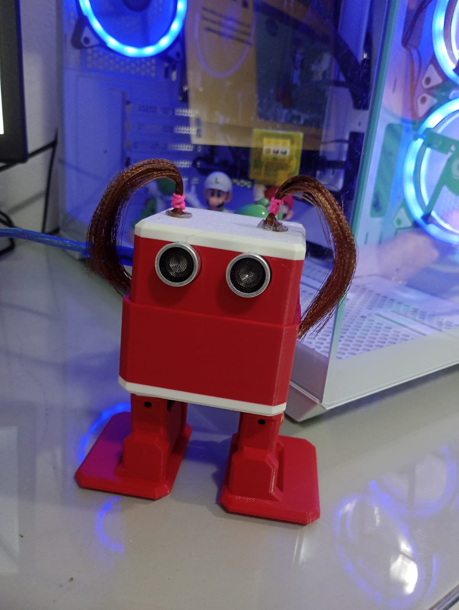

# Documentação do Robô Otto Dançante

Este repositório contém o código e as instruções para o **Robô Otto** realizar movimentos de dança utilizando Arduino. O objetivo é disponibilizar um guia simples, organizado e pronto para ser usado ou modificado pela comunidade.

---

## 🦾 Sobre o Robô Otto
O **Otto DIY** é um robô open-source de fácil montagem, que utiliza servomotores e um microcontrolador (geralmente Arduino Nano) para executar movimentos como caminhar, girar, agachar e dançar. É ideal para projetos educacionais, makers e experimentos com robótica.

---

## 🛠️ Componentes Necessários
- 1x Arduino Nano
- 1x Placa Otto DIY ou protoboard
- 4x Servomotores SG90
- 1x Suporte para 4 pilhas AA ou bateria
- Cabos jumpers
- Estrutura impressa em 3D do Otto DIY

---

## 💃 Funcionalidade de Dança
O código disponibilizado neste repositório faz o Otto realizar:
- Movimentos laterais
- Passos rítmicos
- Giro de 180°
- Agachamentos sincronizados
- Combinação de movimentos baseados em tempo ou música

---

## 📂 Estrutura do Repositório
```
📁 otto-robot
 ├── src/
 │   └── otto_dance.ino
 ├── assets/
 │   ├── otto.jpg
 │   └── danca.mp4
 ├── README.md
 └── LICENSE

```

---

## 🧩 Como Usar
1. Instale a **IDE Arduino**.
2. Adicione a biblioteca **OttoDIYLib** (ou equivalente usada no projeto).
3. Abra o arquivo: `src/otto_dance.ino`.
4. Conecte o Arduino ao computador.
5. Faça o upload do código.
6. Ligue a bateria e veja o Otto dançar! 💃🤖

---

## 🔌 Esquema de Ligação
- Servo perna esquerda → D2
- Servo perna direita → D3
- Servo pé esquerdo → D4
- Servo pé direito → D5
- VCC → 5V
- GND → GND

---

## 🎵 Código Oficial de Teste de Dança
```cpp
#include <Otto.h>

Otto Otto;

#define LeftLeg 2
#define RightLeg 3
#define LeftFoot 4
#define RightFoot 5
#define Buzzer 13   // opcional

void setup() {
  Otto.init(LeftLeg, RightLeg, LeftFoot, RightFoot, true, Buzzer);
  Otto.home();
  delay(1000);
}

void loop() {
  Otto.moonwalker(3, 1000, 25, 1);
  delay(500);
  Otto.moonwalker(3, 1000, 25, -1);
  delay(500);
  Otto.crusaito(3, 1000, 20, 1);
  delay(500);
  Otto.undulation(3, 1000, 20);
  delay(500);
  Otto.swing(3, 1000, 20);
  delay(500);
  Otto.tiptoeSwing(3, 1000, 20);
  delay(500);
  Otto.jitter(20, 100);
  delay(500);
  Otto.crazy(3, 1000);
  delay(800);
}
```

---

## 📸 Foto do Otto



---

## 🎥 Vídeo do Otto dançando

[👉 Clique aqui para assistir ao vídeo](assets/danca.mp4)

---

## ⭐ Créditos

Este projeto foi desenvolvido por:

Angela

Alessandra

Antony

Leonardo

Professor responsável: Peterson

Disciplina: Projeto de Extensão I 

UNEB - Universidade do Estado da Bahia

---

## 🤝 Contribuições
Sinta-se à vontade para abrir issues, enviar PRs ou sugerir novos movimentos de dança!


---

## 📜 Licença
Este projeto pode ser usado livremente sob a licença **MIT**.

---

## ⭐ Créditos

Este projeto foi desenvolvido por:

Angela

Alessandra

Antony

Leonardo

Professor responsável: Peterson

Disciplina: Projeto de Extensão I 

UNEB - Universidade do Estado da Bahia

---

## 🤝 Contribuições
Sinta-se à vontade para abrir issues, enviar PRs ou sugerir novos movimentos de dança!
