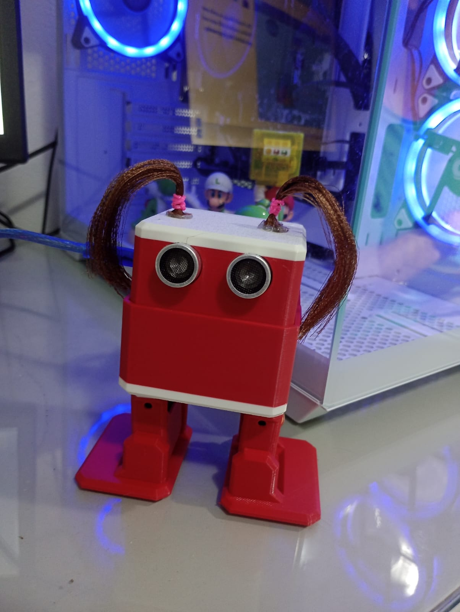

# Documentação do Robô Otto Dançante

Este repositório contém o código e as instruções para o **Robô Otto** realizar movimentos de dança utilizando Arduino. O objetivo é disponibilizar um guia simples, organizado e pronto para ser usado ou modificado pela comunidade.

---


## 🦾 Sobre o Robô Otto
O **Otto DIY** é um robô open-source de fácil montagem, que utiliza servomotores e um microcontrolador (geralmente Arduino Nano) para executar movimentos como caminhar, girar, agachar e dançar. É ideal para projetos educacionais, makers e experimentos com robótica.

--- 

## 🛠️ Componentes Utilizados
Abaixo estão listados todos os componentes, materiais e ferramentas utilizados na montagem física e eletrônica do projeto.

### 🧩 Hardware e Eletrônica

| Item | Qtd. | Categoria | Descrição |
| :--- | :---: | :---: | :--- |
| **Arduino Nano** | 1x | `Microcontrolador` | Placa de desenvolvimento principal. |
| **Shield de Expansão I/O** | 1x | `Placa Base` | Shield de expansão para facilitar as conexões dos pinos. |
| **Servomotores SG90** | 4x | `Atuadores` | Motores responsáveis pela articulação (acompanha braços/hastes). |
| **Sensor Ultrassônico HC-SR04** | 1x | `Sensor` | Utilizado para detecção de obstáculos e distância. |
| **Buzzer 5V** | 1x | `Áudio` | Emissor sonoro para alertas e bipes. |
| **Baterias 1.2V (4800mAh)** | 4x | `Energia` | Fonte de alimentação primária do circuito. |
| **Interruptor de Pressão** | 1x | `Energia` | Chave liga/desliga de auto-travamento (6 pinos, 8x8mm). |
| **Cabos Jumpers** | Q.S.* | `Conexão` | Fios para conexões elétricas rápidas. |

<sub style="font-size: 0.8em;">*Q.S. = Quantidade Suficiente.</sub>

---

### 🖨️ Estrutura Mecânica e Ferramental


* **Chassis do Robô (Design Otto DIY):** Peças totalmente fabricadas via **Impressão 3D**:
  * 1x Cabeça (*Head*)
  * 1x Corpo (*Body*)
  * 2x Pernas (*Legs*)
  * 1x Pé Direito (*Right foot*)
  * 1x Pé Esquerdo (*Left foot*)
* **Elementos de Fixação:** Parafusos diversos para montagem da estrutura e dos servos.


* **Ferro de Solda:** Utilizado para a fixação permanente dos fios no interruptor e conexões de energia.
* **Chave Phillips Magnetizada:** Ferramenta essencial para o alinhamento e fixação dos parafusos nos eixos dos servos.
---

## 💃 Funcionalidade de Dança
O código disponibilizado neste repositório faz o Otto realizar:
- Movimentos laterais
- Passos rítmicos
- Giro de 180°
- Agachamentos sincronizados
- Combinação de movimentos baseados em tempo ou música

---

## 📂 Estrutura do Repositório
```
📁 otto-robot
 ├── src/
 │   └── otto_dance.ino
 ├── assets/
 │   ├── otto.jpg
 │   └── danca.mp4
 ├── README.md
 └── LICENSE

```

---

## 🧩 Como Usar
1. Instale a **IDE Arduino**.
2. Adicione a biblioteca **OttoDIYLib** (ou equivalente usada no projeto).
3. Abra o arquivo: `src/otto_dance.ino`.
4. Conecte o Arduino ao computador.
5. Faça o upload do código.
6. Ligue a bateria e veja o Otto dançar! 💃🤖

---

## 🔌 Esquema de Ligação
- Servo perna esquerda → D2
- Servo perna direita → D3
- Servo pé esquerdo → D4
- Servo pé direito → D5
- VCC → 5V
- GND → GND

---

## 🎵 Código Oficial de Teste de Dança
```cpp
#include <Otto.h>

Otto Otto;

#define LeftLeg 2
#define RightLeg 3
#define LeftFoot 4
#define RightFoot 5
#define Buzzer 13   // opcional

void setup() {
  Otto.init(LeftLeg, RightLeg, LeftFoot, RightFoot, true, Buzzer);
  Otto.home();
  delay(1000);
}

void loop() {
  Otto.moonwalker(3, 1000, 25, 1);
  delay(500);
  Otto.moonwalker(3, 1000, 25, -1);
  delay(500);
  Otto.crusaito(3, 1000, 20, 1);
  delay(500);
  Otto.undulation(3, 1000, 20);
  delay(500);
  Otto.swing(3, 1000, 20);
  delay(500);
  Otto.tiptoeSwing(3, 1000, 20);
  delay(500);
  Otto.jitter(20, 100);
  delay(500);
  Otto.crazy(3, 1000);
  delay(800);
}
```

---

## 📸 Foto do Otto



---

## 🎥 Vídeo do Otto dançando

[👉 Clique aqui para assistir ao vídeo](assets/danca.mp4)

---
  <br>
  <p align="center">
  
</p>

### 👥 Desenvolvedores (Core Team)
* **Alessandra Lemos** 
* **Angela Vidal** 

### 🎓 Orientação & Coordenação
* **Prof. Peterson Lobato** — *Supervisor do Projeto / Laboratório Include*

---

###  Instituição e Contexto
* **Disciplina:** Projeto de Extensão I e II
* **Instituição:** **UNEB** – Universidade do Estado da Bahia
* **Ecossistema:** Lab Include / Cultura Maker & Robótica

---


## 🤝 Contribuições
Sinta-se à vontade para abrir issues, enviar PRs ou sugerir novos movimentos de dança!
